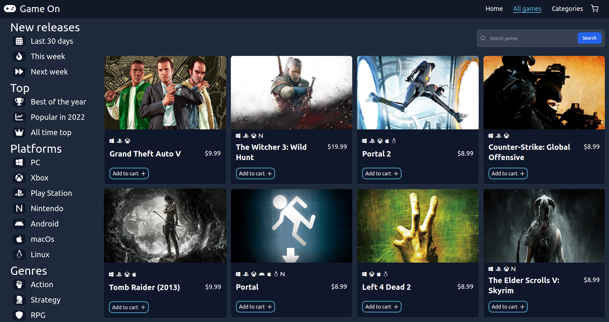

# Game On (shopping cart app)

[Live Preview](https://game-on-top.netlify.app/) 👈

# Functionality

- Look through a catalog of 500.000+ games provided by RAWG API.
- Filter the game results by categories or tags.
- Search your favourite game using a percise filter.
- Select any game to see a carousel of in game screenshots, esrb rating for the game, a description, and aditional info about the game, like release date, game genres, platforms the game is available, developers, publishers, and its metacritic score.
- Add any game you like to your shopping cart, and see the total value of your cart.
- Price generated based on release year, and tags like indie games.
  

# My learnings
- Development of a full angular app.
- Angular routing (default routing, route parameters to use an specific parameter of the route to use it in the app, and not found route).
- Angular components and modules (property and event binding, interpolation).
- Communication between components with Input/Output decorators and binding.
- Conditional display of components and html objects (ngIf, ngFor, ngSwitch).
- Angular HttpClient to make requests (API).
- Angular services (injectables, with observable vars).
- TypeScript interfaces.
- tailwind class styles.
- Netlify deployment with client side routing.
